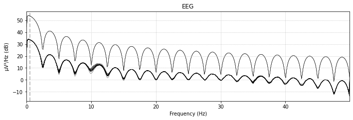

# Motor Imagery Classification

Motor imagery is the action of thinking about a movement without actually moving your body. This project aims to classify motor imagery movements using classical machine learning algorithms based on EEG signals. 

The data was gathered from the Berlin Brain-Computer Interface's BCI Competition IV [dataset 2a](https://www.bbci.de/competition/iv/#dataset2a). 

The methods used for classification include using Linear Discriminant Analysis (LDA), Support Vector Machine (SVM), and K-Nearest Neighbors (KNN). The EEG signals were processed using Common Spatial Pattern (CSP). 

The problem was formulated as a binary classification problem. The classes attempting to be separated include the following: left hand vs. right hand, left hand vs. tongue, and left hand vs. foot. 

This project was completed as part of the undergraduate course **COGS 189: Brain Computer Interfaces** under the guidance of Professor Virginia de Sa. 

## Description of Files 

### Scripts
1. **MotorImagery.ipynb** : Details the steps performing classical machine learning classifiers on binary classification problems. 

2. **/matfiles/dataset_export.m** : MATLAB script extracting gdf files from **BCICIV_2a_gdf** into *.mat* files using EEGLAB. 

### Other
3. **BCICIV_2a_gdf/** : Folder containing EEG signals as *.gdf* files. 

## Results

### Left Hand vs. Right Hand

### Left Hand vs. Tongue

### Left Hand vs. Foot

